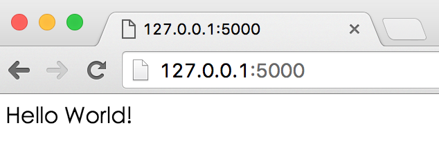

# 基本安装

Flask 的安装很简单，可以全局安装，也可以使用虚拟环境安装。

## 全局安装

全局安装可以直接使用以下命令：

```python
$ sudo pip install flask
```


## 使用 virtualenvwrapper

- 第 1 步，先安装 virtualenvwrapper，`$ [sudo] pip install virtualenvwrapper`
- 第 2 步，`$ source /usr/local/bin/virtualenvwrapper.sh`
- 第 3 步，新建一个虚拟环境，`$ mkvirtualenv env1`

此时，可以看到命令行前面会多出一个括号，这说明你已经进入名为 `env1` 的虚拟环境了，以后 `easy_install` 或者 `pip` 安装的所有模块都会安装到该虚拟环境目录里。

- 第 4 步，安装 flask

```
(env1) $ pip install flask
```


## 一个最简单的例子：Hello World

新建一个脚本文件，比如 `hello.py`。

```python
$ cat hello.py

from flask import Flask

app = Flask(__name__)

@app.route("/")
def index():
    return "Hello World!"

if __name__ == "__main__":
    app.run()
```

在终端运行：

```python
$ python hello.py
* Running on http://localhost:5000/
```

在浏览器输入链接 `http://localhost:5000/`，可以看到 Hello World! 



